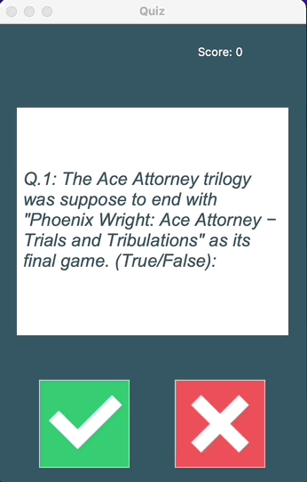
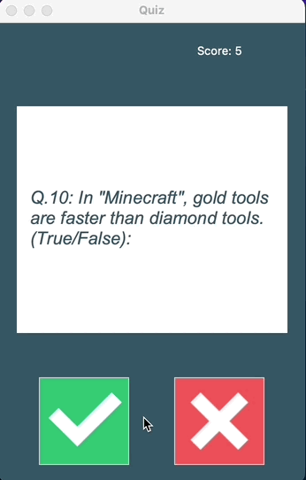

##Welcome to Trivia Quiz 🎮
**A Quiz using the OPEN TRIVIA DATABASE api.**

##Getting Started
###When it is initialized the questions are received from the API,where the user can choose between right and wrong. 
####The game initially has 10 questions, but if you want you can change the number of questions on data.py "amount".
```python
parameters= {
    "amount": 10,
    "type": "boolean"
}
```

###If the user correctly ✅ answers the question, the background of the question will be green and if wrong ❌, it will be red.
###Above the right side, there will be the "Score" space, where it will show the number of questions that the user got right.



###Questions will be generated while you still have unanswered questions


##Challenges.
###The challenges of this project were working with api together with a visual interface.


###I am open to new ideas and suggestions 😀

